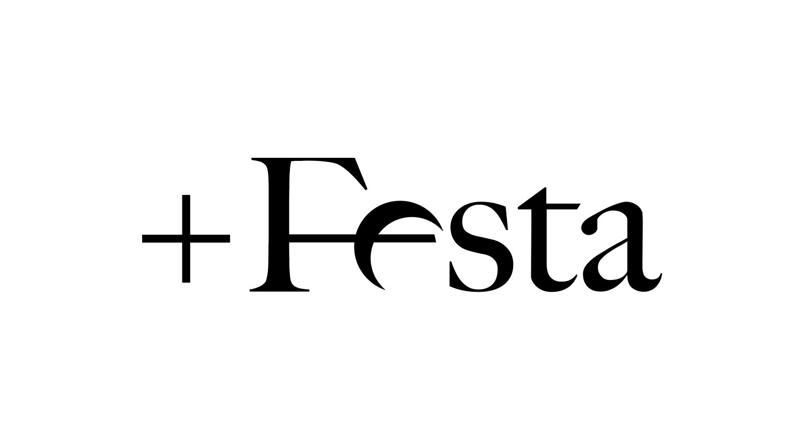

<p align="center">
  <a href="#" target="blank"></a>
</p>

# 1. Local without Docker
## Installation

```bash
$ yarn install
```

## Running the app

```bash
# development
yarn run start

# watch mode
yarn run start:dev
npm run start:dev

# production mode
yarn run start:prod
```

## Test

```bash
# unit tests
yarn run test

# e2e tests
yarn run test:e2e

# test coverage
yarn run test:cov
```

# Initial configuration
1. Cloning the project
2. Install dependencies ```yarn install```
3. Copy the file ```.env.template``` and rename it to ```.env```
4. Update the environment values
5. Start the database ```docker-compose up -d```
6. Launch the app in dev mode ```yarn start:dev```
7. Execute seed for get dummy data ```localhost:4000/api/seed ```

# 2. Localhost with Docker

## Installing Docker
First of all, you need install [docker](https://docs.docker.com/get-docker/)

After that, you can install Docker Desktop in MacOs.

## Initial configuration
Once Docker is installed, launch the following command in the root of the project in your terminal:
```bash
# install all dependencies and initial database
make start
```

If there is no problem, the API is launched on the ```localhost:4000```

Execute seed for get dummy data in database:
```shell
localhost:4000/api/seed
```

## Running and stop app
For run or stop the app, launch the following commands in your root repository in your terminal
```bash
# run app
make start

# stop app
make stop
```
